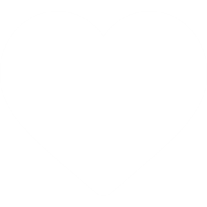
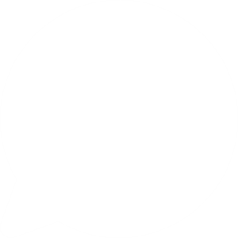
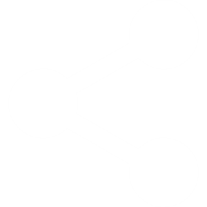
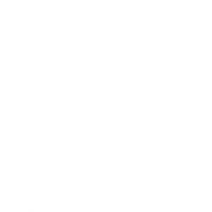

# UASPPW1_22-505018-SV-21751_LYRA-Literary-Realm
### Sena Aji Bayu Murti

# LYRA - Literary Realm
> 
>
>Lyra logotype

Adalah sebuah website untuk para penulis di luar sana, baik pemula maupun profesional. Setiap karya sastra tulis dibagikan kepada semua pengguna LYRA dengan harapan meningkatkan minat baca ke semua orang. Setiap pengguna bisa merespon setiap karya dengan menekan tombol "Like", berkomentar pada kolom "Comment", membagikan literatur dengan fitur "Share" ataupun menyimpan tulisan di dalam "Bookmark" masing-masing. Di sini lah kalian bisa memulai untuk menulis.
>
>
>Preview LYRA

Menanggapi klien untuk diciptakannya website LYRA, warna utama sebagai identitas produk adalah cyan. Kemudian demi melancarkan tujuan utama yaitu meningkatkan minat baca, desain tampilan secara umum didominasi dengan tone yang gelap dan warna font putih untuk memudahkan para pembaca dalam membaca dan kenyamanan saat membaca karena di depan layar digital. Sehingga dengan kenyamanan yang disediakan bisa membuat para pembaca bertahan lebih lama dalam menikmati karya sastra yang disediakan.

## DESAIN
- Logo
  - Logo berupa logotype sederhana dengan modifikasi kecil pada huruf "L" dan "Y". Merujuk pada gambar 'Lyra logotype' bisa dilihat bahwa spasi diantara kedua huruf tersebut membentuk siluet buku yang setengah terbuka atau laptop yang setengah terbuka tergantung interpretasi masing-masing individu. Ini mengisyaratkan di masa serba digital ini bahwa membaca tidak hanya melalui buku yang terlalu pakem, bahan bacaan bisa di dapat dari mana saja namun buku tetaplah penting sebagai sumber utama ilmu pengetahuan.
  - Warna logo menyesuaikan dengan identitas brand yaitu cyan. Warna yang cukup terang dan mencolok, serta cukup kontras dengan tampilan produk secara keseluruhan yaitu abu-abu gelap.
- Font
  - Font yang kami pilih adalah Bahnschrift. Font mainstream, namun kami pilih karena desainnya yang sederhana dan mudah dibaca namun masih memeliki estetika tidak terlihat begitu standar. Font ini juga merupakan font dasar yang digunakan untuk mendesain logo.
> 
>
>Font Bahnschrift

- Warna
  - Sebagaimana yang sudah disebutkan sebelumnya warna utama adalah cyan `#00ffff`, kemudian putih `#ffffff` serta tiga warna lain yang menjadi dasar warna layout secara keseluruhan:
> ```css
> :root{
> --abu1:#131313;
> --abu2:#0a0a0a;
> --abu3:#0a0a0a80;
> }
> ```
> 
> Opsi warna

- Layout
  - Layout pada dasarnya tidak terlalu banyak visualisasi yang cukup ilustratif bertujuan agar pengguna tidak terlalu terganggu dengan tampilan website sehingga bisa fokus dan nyaman dalam membaca.
  - Layout pada halaman utama atau "Beranda" dibagi menjadi tiga bagian utama yaitu ada `left-bar`, `mid-bar`, dan `right-bar`. 
>
>
>Halaman utama

  - `left-bar` merupakan side bar berisikan tombol-tombol navigasi berbagai menu beserta penempatan logo.
  - `mid-bar` sebagai bagian tengah halaman merupakan bagian utama untuk menampilkan "feed" berisikan semua unggahan para pengguna. Penempatan "feed" yang berada di tengah bertujuan menyesuaikan fokus utama mata pengguna dalam melihat layar
>
>
>Tampilan profil dan postingan

  - `right-bar` merupakan bar utilitas yang hanya muncul untuk halaman utama atau "Beranda". Berisi menu "Category" dan "Tag" dengan opsi di dalamnya untuk memfilter konten yang ada di "Beranda". Merujuk pada gif 'Tampilan profil dan postingan' pada tampilan profil pengguna dan postingan bisa dilihat bahwa `right-bar` dihilangkan.

## WEBSITE RESPONSIVE
Target pengguna website ini adalah semua umur, dengan begitu jangkauan pasar yang luas diperlukan dengan menargetkan pengguna layar yang besar seperti Laptop, kemudian Tablet, dan Smartphone. Untuk itu desain website yang responsif diperlukan. 

Desain responsif yang kami lakukan pada dasarnya tediri dari dua desain, desain pertama untuk layar yang lebih lebar seperti tablet dan laptop serta desain kedua untuk layar yang lebih kecil untuk smartphone.

> ```css
> @media (max-width: 1024px){}
> @media (max-width: 768px){}
> @media (max-width: 767px){}
> @media (max-width: 375px){}
> @media (max-width: 280px){}
> ```
> 
> Klasifikasi pembagian layar media query

Mengacu pada "Klasifikasi pembagian layar media query" media query yang mengatur layar yang lebih lebar adalah media query baris pertama dan kedua, tampilannya masih menampilkan ketiga layout utama. Hanya mengatur padding dan ukuran font menyesuaikan kenyamanan pengguna. Kemudian untuk klasifikasi pada media query baris ketiga, keempat, dan kelima adalah untuk menyesuaikan untuk layar smartphone.
> ```css
> @media (max-width: 1024px){
>     #synopsis-bar{
>         padding: 10px;
>     }
> }
> @media (max-width: 768px){
>     #synopsis-bar{
>         font-size: 15px;
>         padding: 20px;
>     }
> }
> ```
> Klasifikasi media query layar lebih lebar

Pada tampilan website yang lebih kecil, bar utilitas `right-bar` disembunyikan, untuk itu menu "Category" dan "Tag" ditaruh bersama dengan menu lainnya pada `left-bar` yang ditaruh di atas `mid-bar`. Pada awalnya, merujuk ke file `homePageCSS.css` dan file css dengan format nama `(section)CSS.css` lainnya, terdapat tag div dengan id "hidden-menu" yang akan ditampilkan hanya untuk tampilan layar lebih kecil atau smartphone.
> ```css
>     #hidden-menu{
>         display:block;
>     }
>     #third-row{
>         display: none;
>     }
> ```
> 
> Desain ulang tampilan untuk layar lebih kecil

> 
> 
> 
> Tampilan untuk layar smartphone

## PENYESUAIAN DENGAN PRINSIP DESAIN
### Visibility
Seperti yang sudah dijelaskan sebelumnya, kombinasi warna yang kontras dengan warna dasar kombinasi abu-abu gelap dan putih yang kontras memudahkan pengguna dalam membaca dan memberi kenyamanan untuk mata dalam membaca dengan durasi yang lama. Kemudian warna identitas produk yaitu cyan digunakan sebagai warna ilustratif. Seperti pada menu "Beranda" beserta ikonnya yang berwarna cyan saat pengguna melihat halaman "Beranda". Kemudian ada tombol "BACA" dengan warna cyan yang mempermudah visualiasi pengguna untuk membaca lebih lanjut.
> 
> 
>
> Tampilan menu "Beranda" dan tombol "BACA"

### Feedback
Klik "BACA" mengarahkan pengguna ke laman baru
Berbagai tombol dan fitur yang belum bisa kemduian alert

### Constraints
Usaha kami untuk memenuhi prinsip desain *constraints* adalah dengan menggunakan fungsi alert. Setiap pengguna ingin menyukai suatu postingan atau menyimpannya ke "Bookmark" dan mereka belum log in ke LYRA, akan ditampilkan alert "Anda perlu log in." 
> ```php
> onclick=\"redirectToOtherPage()\"
> ```
> ```javascript
> function redirectToOtherPage() {
>     alert('Anda perlu log in.');
>     window.location.href = 'profilePage.html'; // Ganti dengan URL halaman lain yang diinginkan
> }
> ```
> 
> Fungsi alert untuk mengarahkan pengguna agar segera log in.

### Consistency
Menjaga konsistensi artstyle tampilan website bisa membuat pengguna nyaman menggunakan website. Untuk itu kami membagi tampilan website menjadi tiga bar seperti yang sudah dijelaskan pada bab "DESAIN". Kemudian konsistensi desain ikon dengan gaya full-block agar visualisai jelas dan ilustratif. 
> 
> 
> 
> 
> 
> 
> 
> 
> 
> 
> 
> 
> Icon dasar yang digunakan

## WEBSITE DINAMIS
Di dalam `mid-bar` terdapat php yang menampilkan semua konten dari tabel `post-table` dari database `lyra_database`. Melakukan iterasi untuk menampilkan semua baris pada tabel `post-table` yang kemudian isi datanya didistribusikan ke setiap tag yang sesuai.
> ```php
> <!-- KONTEN UTAMA -->
>                 <?php
>                 include 'connection.php';
> 
>                 $post_table = mysqli_query($conn, "SELECT * FROM post_table");
>                 $user_table = mysqli_query($conn, "SELECT * FROM user_table");
>                 $user_by_id_post = "SELECT post_table.id_post, user_table.name_user FROM post_table INNER JOIN user_table ON post_table.id_user = user_table.id_user";
>                 $user_by_id_post_result = mysqli_query($conn, $user_by_id_post);
>                 $user_names = array();
>                 if (mysqli_num_rows($user_by_id_post_result) > 0) {
>                     while ($name_user = mysqli_fetch_assoc($user_by_id_post_result)) {
>                         $user_names[$name_user['id_post']] = $name_user['name_user'];
>                     }
>                 }
>                 
>                 foreach ($post_table as $post){
>                     $id_post = $post['id_post'];
>                 
>                     $function_total_like = mysqli_query($conn, "SELECT function_total_like($id_post) AS total_like");
>                     $total_like = mysqli_fetch_assoc($function_total_like)['total_like'];
>                 
>                     $function_total_comment = mysqli_query($conn, "SELECT function_total_comment($id_post) AS total_like");
>                     $total_comment = mysqli_fetch_assoc($function_total_comment)['total_like'];
>                     echo 
>                     "<div id='main-content-panel' class='card border-0'>
>                         
>                         <div id='profile-bar' class='card-title text-center'>
>                             <h3 id='h-title'>
>                                 <p id='title-article'>
>                                     ".$post['title_post']."
>                                 </p>
>                             </h3>
>                             <p id='date-article'>
>                                 ".$post['date_post']."
>                             </p>
>                             <a class='link' href='#'>
>                                 ".$user_names[$id_post]."
>                             </a>
>                         </div>
>                         <div id='synopsis-bar' class='card-body'>
>                             <p id='synopsis'>
>                                 ".$post['synopsis_post']."
>                             </p>
>                             <button id='read-btn' class='btn btn-block' type='button' onclick=\"location.href='postPage.php?data-id=".$id_post."'\">BACA</button>
>                         </div>
>                         <div id='like-bar' class='card-footer row justify-content-center'>
>                             <div class='col-md-3'>
>                                 <button onclick=\"redirectToOtherPage()\">
>                                     <div>
>                                         
>                                     </div>
>                                     <div id='text-btn'>
>                                         <span class='like-count'>
>                                             ".$total_like."
>                                         </span>
>                                     </div>
>                                 </button>
>                             </div>
>                             <div class='col-md-3'>
>                                 <button onclick=\"redirectToOtherPage()\">
>                                     <div>
>                                         
>                                     </div>
>                                     <div id='text-btn'>
>                                         <span class='comment-count'>
>                                             ".$total_comment."
>                                         </span>
>                                     </div>
>                                 </button>
>                             </div>
>                             <div class='col-md-3'>
>                                 <button onclick=\"redirectToOtherPage()\">
>                                     <div>
>                                         
>                                     </div>
>                                     <div id='text-btn'>
>                                         <span class='share-count'>2</span>
>                                     </div>
>                                 </button>
>                             </div>
>                             <div class='col-md-3'>
>                                 <button onclick=\"redirectToOtherPage()\">
>                                     <div>
>                                         
>                                     </div>
>                                 </button>
>                             </div>
>                         </div>                      
>                     </div>
>                     ";
>                 }
>                 ?>
>                 <!-- KONTEN UTAMA -->
> ```
>
> PHP untuk menampilkan konten

PHP yang lain bisa dilihat pada file `postPageCSS.css` dan `profilePage.html`.
